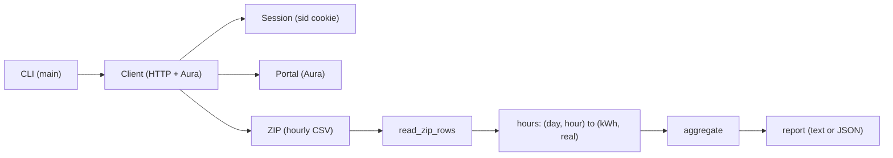
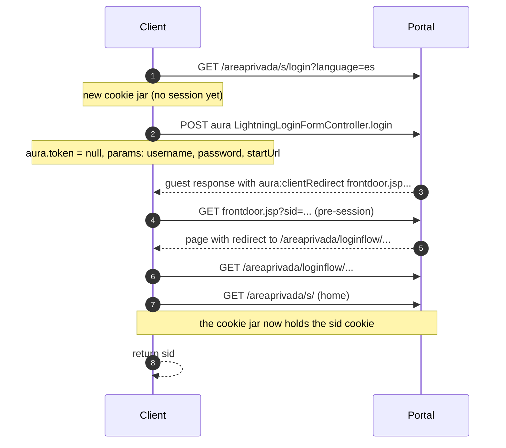
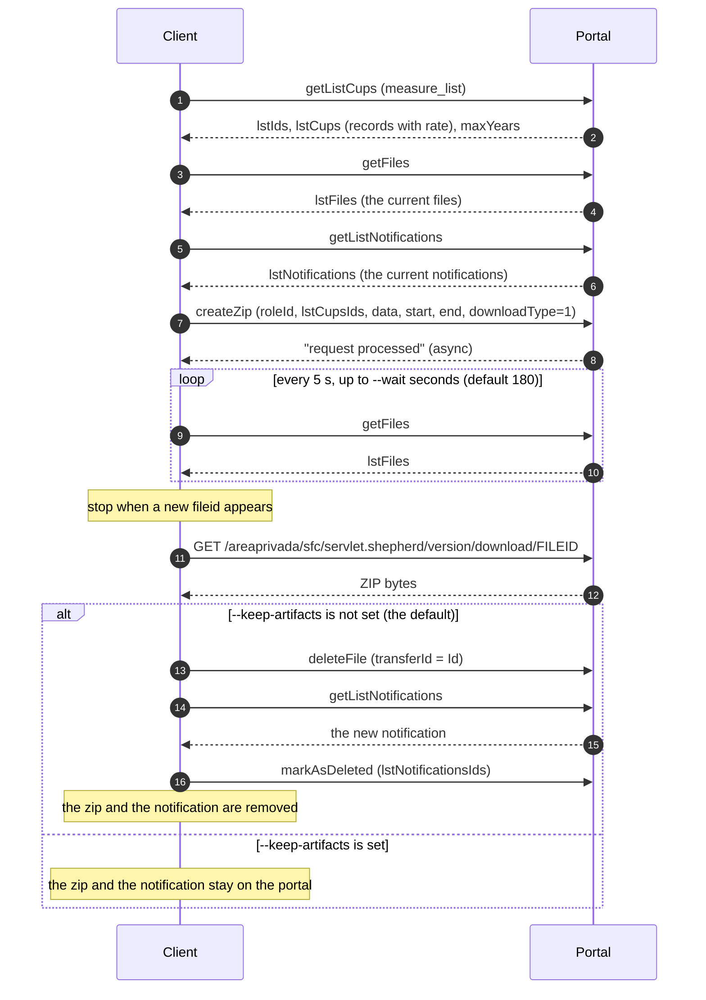
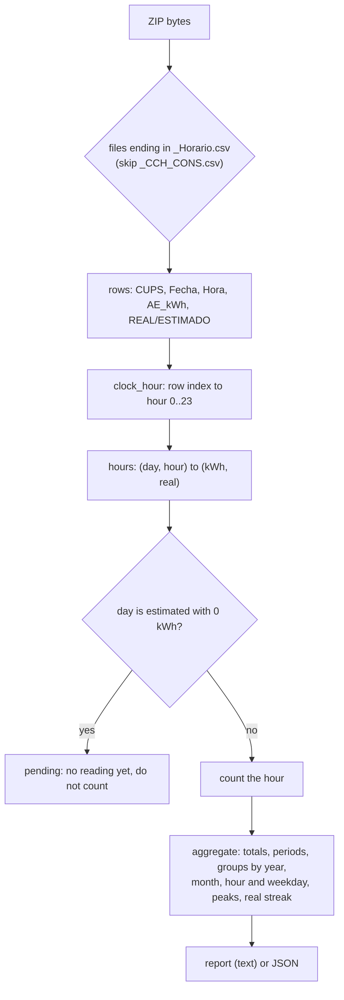
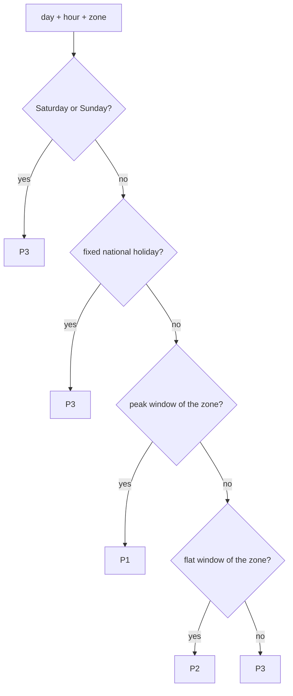
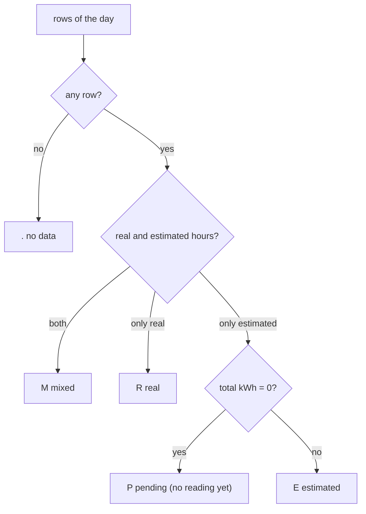

# Architecture and Aura flows

This file explains the technical steps the tool takes against the e-distribucion
private area (zonaprivada.edistribucion.com). The portal runs on Salesforce
Experience Cloud, so the client talks to the Aura endpoint.

The diagrams use [Mermaid](https://mermaid.js.org/). GitHub shows them in this
file.

## 1. Overview



- `Session` keeps the `sid` cookie and writes `session.json`.
- `Client` does the HTTP work and the Aura calls.
- The data comes as one ZIP. The tool reads the CSV rows and builds the report.

## 2. The Aura protocol

Every action uses the same shape. First the tool loads a community page, then it
reads the anti-CSRF token from a `Set-Cookie` header. Then it posts the action.


- The token is not decoded. The tool reads the `eyJ...` value from the
  `__Host-ERIC...` cookie and sends it back.
- The token is the value of a session cookie, so the tool fetches it one time
  for each run and reuses it for every page. This saves one page load for each
  page.
- The `fwuid` and the app version are refreshed from `context` in every
  response. This keeps the tool working when the portal changes them.

## 3. Login without a browser

`login` (and the auto login) use the portal login action. The login page is a
guest page, so its token is `null`.



The tool follows the chain: frontdoor, login flow, landing page, home. The home
page then sets the `sid` cookie and the `aura.token` cookie.

## 4. The massive download

The full hourly history comes as one ZIP. The portal makes it in the background,
so the tool waits and then downloads it.



- `downloadType=1` is the hourly data. The portal also has a quarter-hourly
  value (`2`).
- The range is the first contract start to the last contract end. The portal
  clips the ZIP per contract version. Each version becomes one CSV pair.
- The tool lists the files and the notifications first, so it can detect the new
  ones and delete them after the read.
- The notification has the title `Descarga de curvas de consumo` and the URL
  `.../wp-massivemeasuredownload-v3#downloads`. The tool deletes only the new
  notifications of this URL.
- The portal can make no notification when the role has the setting "No deseo
  recibir más notificaciones para este rol" (I do not want more notifications
  for this role). In that case there is nothing to delete.

## 5. Data pipeline



- The tool reads one value per day, so a day with the change of the hour has 23
  or 25 rows. See section 7.
- A day with no reading yet comes as estimated with 0 kWh. The tool calls it
  `pending` and keeps it out of the totals. The recent zoom shows it.
- `longest_real_run` finds the longest period in a row with real data only.
  `aggregate` keeps its totals by P1, P2 and P3, so a comparator can use the
  real hours only.

## 6. The 2.0TD period

The portal does not send the tariff period with the ZIP. The tool works out the
period from the date, the hour and the zone. See
[TARIFF_2_0TD.md](TARIFF_2_0TD.md) for the law and the details.



The peak and flat windows depend on the zone: the Peninsula, Baleares and
Canarias one set, and Ceuta and Melilla another set, one hour later.
`supply_zone` reads the postal code (51xxx is Ceuta, 52xxx is Melilla), then the
city name, then the Peninsula.

## 7. The day status

The recent zoom and the reading map use one symbol per day.



## 8. Endpoints and actions

| alias | route | descriptor | page |
| ----- | ----- | ---------- | ---- |
| `login_info` | `WP_Monitor_CTRL.getLoginInfo` | `apex://WP_Monitor_CTRL/ACTION$getLoginInfo` | `/areaprivada/s/` |
| `measure_list` | `WP_Measure_v3_CTRL.getListCups` | `apex://WP_Measure_v3_CTRL/ACTION$getListCups` | `/areaprivada/s/wp-massivemeasuredownload-v3` |
| `create_zip` | `WP_Measure_v3_CTRL.createZip` | `apex://WP_Measure_v3_CTRL/ACTION$createZip` | `/areaprivada/s/wp-massivemeasuredownload-v3` |
| `get_files` | `WP_Download_Transfer_CTRL.getFiles` | `apex://WP_Download_Transfer_CTRL/ACTION$getFiles` | `/areaprivada/s/wp-massivemeasuredownload-v3` |
| `delete_file` | `WP_Download_Transfer_CTRL.deleteFile` | `apex://WP_Download_Transfer_CTRL/ACTION$deleteFile` | `/areaprivada/s/wp-massivemeasuredownload-v3` |
| `notifications_list` | `WP_NotificationsList_CTRL.getListNotifications` | `apex://WP_NotificationsList_CTRL/ACTION$getListNotifications` | `/areaprivada/s/wp-notificationslist` |
| `delete_notifications` | `WP_NotificationsList_CTRL.markAsDeleted` | `apex://WP_NotificationsList_CTRL/ACTION$markAsDeleted` | `/areaprivada/s/wp-notificationslist` |
| `maximeter` | `WP_MaximeterHistogram_CTRL.getHistogramPoints` | `apex://WP_MaximeterHistogram_CTRL/ACTION$getHistogramPoints` | `/areaprivada/s/wp-maximeterhistogramdetail` |
| `atr_detail` | `WP_ContractATRDetail_CTRL.getATRDetail` | `apex://WP_ContractATRDetail_CTRL/ACTION$getATRDetail` | `/areaprivada/s/wp-atrcontractdetail` |

## 9. Request shape

The Aura body is form data with four fields. The tool builds them in
`Client.call`.

```
message = {
  "actions": [{
    "id": "1;a",
    "descriptor": "apex://WP_Measure_v3_CTRL/ACTION$getListCups",
    "callingDescriptor": "markup://c:WP_Massive_Measure_Download_v3",
    "params": { ... }
  }]
}

aura.context = {
  "mode": "PROD",
  "fwuid": "<current framework uid>",
  "app": "siteforce:communityApp",
  "loaded": { "APPLICATION@markup://siteforce:communityApp": "<version>" },
  "dn": [], "globals": {}, "uad": true
}

aura.pageURI = "/areaprivada/s/wp-massivemeasuredownload-v3"
aura.token   = "<value of the __Host-ERIC... cookie>"
```

The response holds one action. The tool reads `actions[0].returnValue` and
stops on a `state` that is not `SUCCESS`.

## 10. The API the tool does not use

`WP_Measure_v3_CTRL.getChartPointsByRange` gives the hourly curve, but only for
a short range (about 35 days per call). The full history needs many calls, so
the tool uses the one ZIP instead. See
[ASSUMPTIONS.md](ASSUMPTIONS.md).

## 11. Where each part lives

| part | in the code |
| ---- | ----------- |
| Aura body and POST | `Client.call`, `Client.token`, `Client._read_context` |
| Browserless login | `portal_login`, `login_context` |
| Session file | `Session` |
| Context and supplies | `load_context`, `build_supplies`, `list_measure_cups` |
| Massive download | `create_zip`, `get_files`, `_download_measure_zip` |
| Cleanup on the portal | `list_notifications`, `delete_notifications`, `download_notification_ids`, `delete_download_leftovers` |
| ZIP read | `read_zip_rows`, `clock_hour`, `zip_hours` |
| CSV export | `write_hours_csv`, `export_path_for` |
| Zone | `supply_zone`, `ZONE_PEAK_HOURS`, `ZONE_FLAT_HOURS` |
| Period and day logic | `tariff_period`, `in_hour_windows`, `day_status`, `month_map`, `recent_ranges` |
| Demanded power | `get_maximeter`, `_max_demand`, `demand_point`, `max_demand_periods` |
| Aggregation and report | `aggregate`, `longest_real_run`, `fetch_hours`, `collect_consumption`, `_build_report`, `_print_report` |
| Trace | `Trace`, `trace_start`, `headers_text`, `body_text` |
