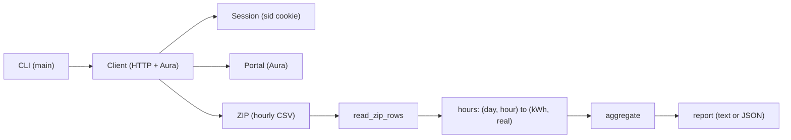
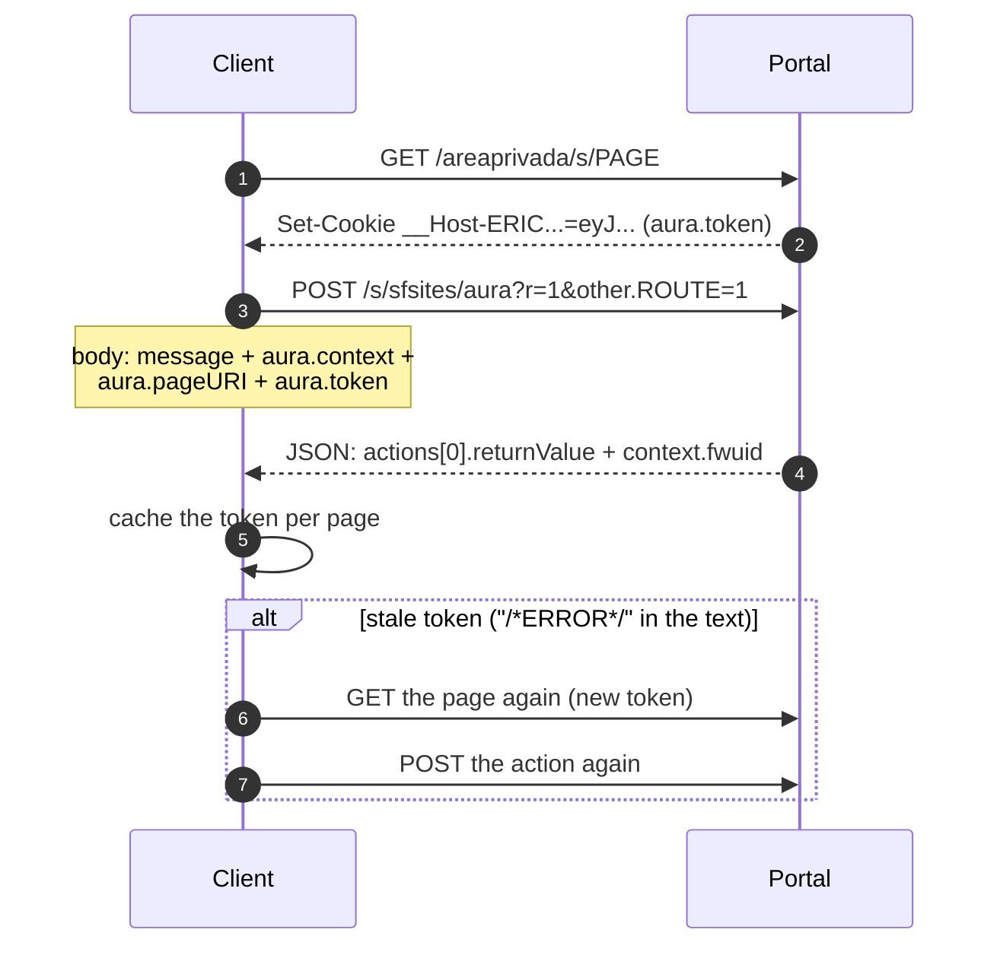
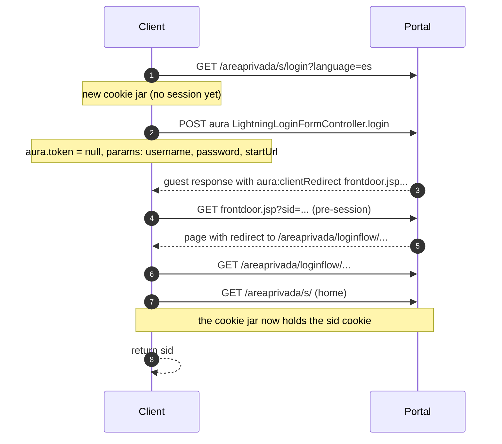
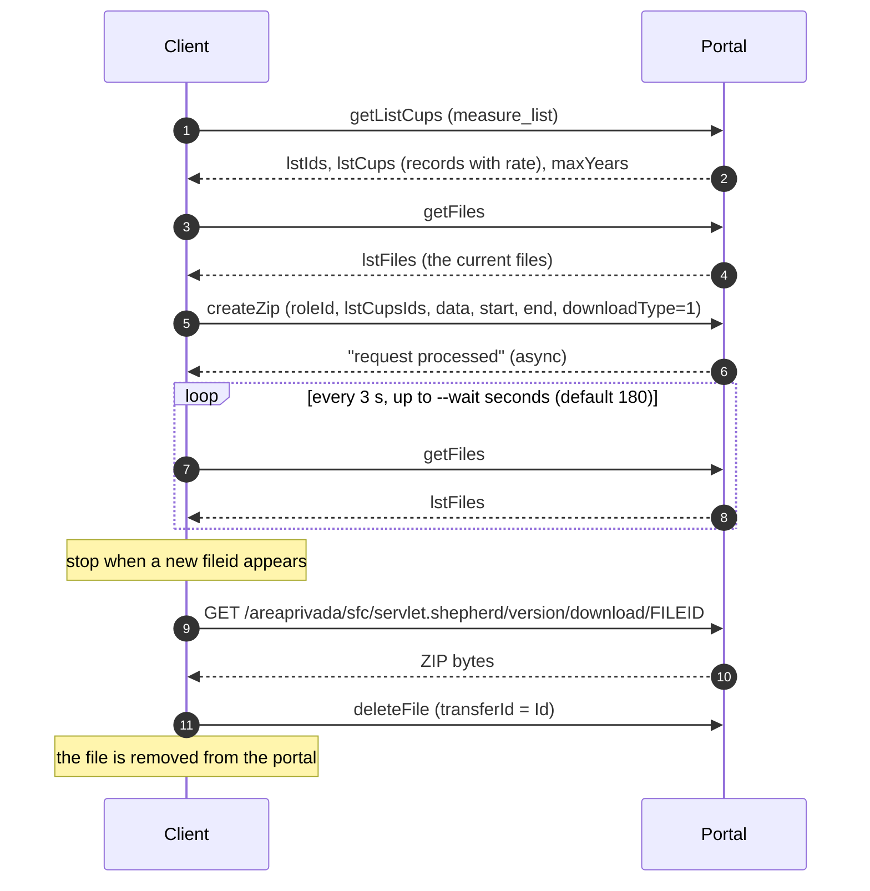
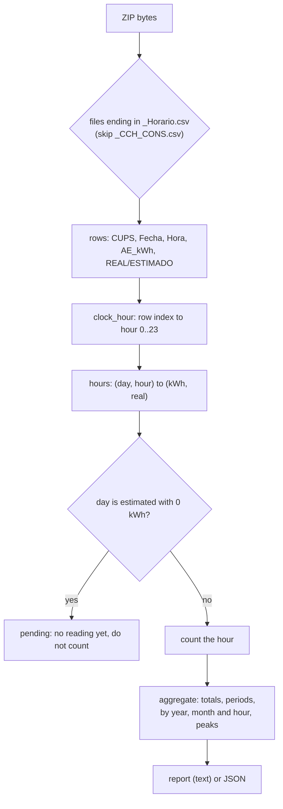
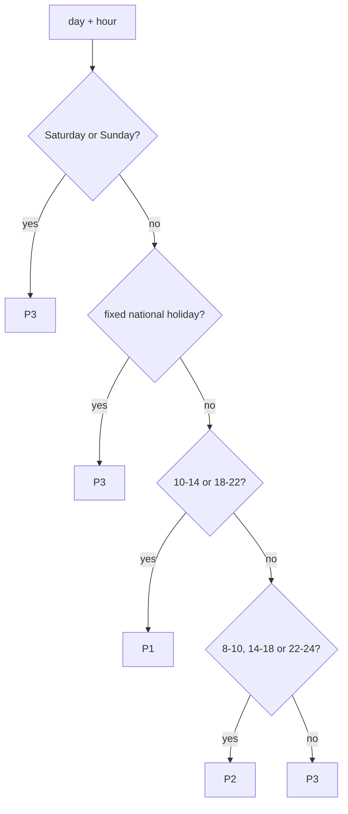
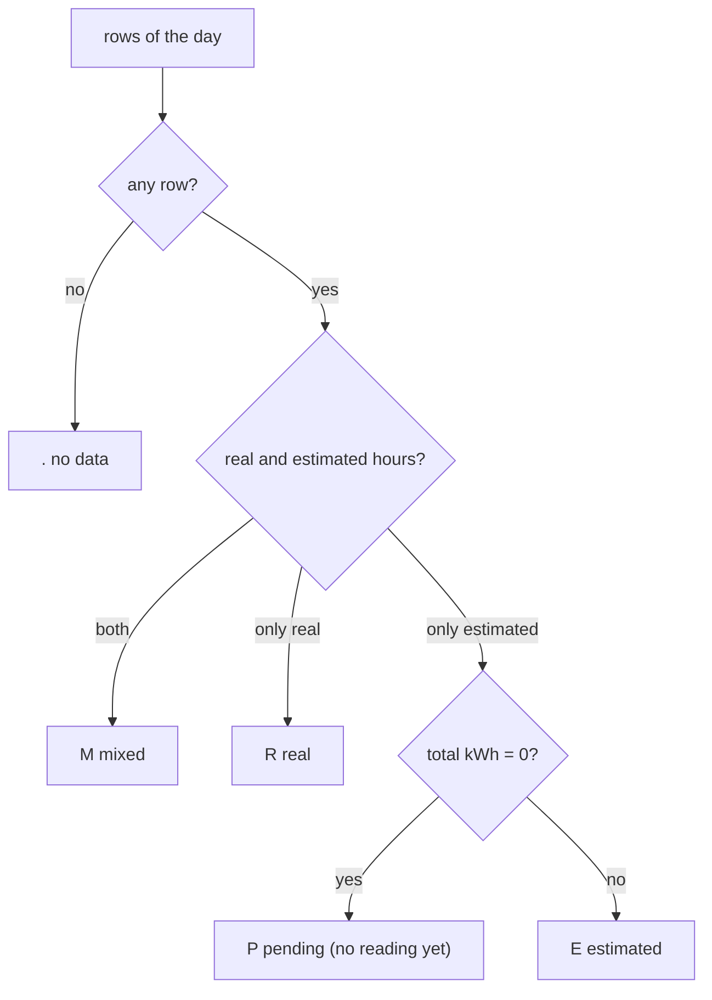

# Architecture and Aura flows

This file explains the technical steps the tool takes against the e-distribucion
private area (zonaprivada.edistribucion.com). The portal runs on Salesforce
Experience Cloud, so the client talks to the Aura endpoint.

The diagrams use [Mermaid](https://mermaid.js.org/). GitHub shows them in this
file.

## 1. Overview



- `Session` keeps the `sid` cookie and writes `session.json`.
- `Client` does the HTTP work and the Aura calls.
- The data comes as one ZIP. The tool reads the CSV rows and builds the report.

## 2. The Aura protocol

Every action uses the same shape. First the tool loads a community page, then it
reads the anti-CSRF token from a `Set-Cookie` header. Then it posts the action.



- The token is not decoded. The tool reads the `eyJ...` value from the
  `__Host-ERIC...` cookie and sends it back.
- The `fwuid` and the app version are refreshed from `context` in every
  response. This keeps the tool working when the portal changes them.

## 3. Login without a browser

`login` (and the auto login) use the portal login action. The login page is a
guest page, so its token is `null`.



The tool follows the chain: frontdoor, login flow, landing page, home. The home
page then sets the `sid` cookie and the `aura.token` cookie.

## 4. The massive download

The full hourly history comes as one ZIP. The portal makes it in the background,
so the tool waits and then downloads it.



- `downloadType=1` is the hourly data. The portal also has a quarter-hourly
  value (`2`).
- The range is the first contract start to the last contract end. The portal
  clips the ZIP per contract version. Each version becomes one CSV pair.
- The tool lists the files first, so it can detect the new file and delete it
  after the read.

## 5. Data pipeline



- The tool reads one value per day, so a day with the change of the hour has 23
  or 25 rows. See section 7.
- A day with no reading yet comes as estimated with 0 kWh. The tool calls it
  `pending` and keeps it out of the totals. The recent zoom shows it.

## 6. The 2.0TD period

The portal does not send the tariff period with the ZIP. The tool works out the
period from the date and the hour. See
[TARIFF_2_0TD.md](TARIFF_2_0TD.md) for the law and the details.



## 7. The day status

The recent zoom and the reading map use one symbol per day.



## 8. Endpoints and actions

| alias | route | descriptor | page |
| ----- | ----- | ---------- | ---- |
| `login_info` | `WP_Monitor_CTRL.getLoginInfo` | `apex://WP_Monitor_CTRL/ACTION$getLoginInfo` | `/areaprivada/s/` |
| `list_cups` | `WP_Measure_v3_CTRL.getListCups` | `apex://WP_Measure_v3_CTRL/ACTION$getListCups` | `/areaprivada/s/wp-measurelist-v4` |
| `get_info` | `WP_Measure_v3_CTRL.getInfo` | `apex://WP_Measure_v3_CTRL/ACTION$getInfo` | `/areaprivada/s/wp-measure-detail-v4` |
| `measure_list` | `WP_Measure_v3_CTRL.getListCups` | `apex://WP_Measure_v3_CTRL/ACTION$getListCups` | `/areaprivada/s/wp-massivemeasuredownload-v3` |
| `create_zip` | `WP_Measure_v3_CTRL.createZip` | `apex://WP_Measure_v3_CTRL/ACTION$createZip` | `/areaprivada/s/wp-massivemeasuredownload-v3` |
| `get_files` | `WP_Download_Transfer_CTRL.getFiles` | `apex://WP_Download_Transfer_CTRL/ACTION$getFiles` | `/areaprivada/s/wp-massivemeasuredownload-v3` |
| `delete_file` | `WP_Download_Transfer_CTRL.deleteFile` | `apex://WP_Download_Transfer_CTRL/ACTION$deleteFile` | `/areaprivada/s/wp-massivemeasuredownload-v3` |
| `maximeter` | `WP_MaximeterHistogram_CTRL.getHistogramPoints` | `apex://WP_MaximeterHistogram_CTRL/ACTION$getHistogramPoints` | `/areaprivada/s/wp-maximeterhistogramdetail` |
| `atr_detail` | `WP_ContractATRDetail_CTRL.getATRDetail` | `apex://WP_ContractATRDetail_CTRL/ACTION$getATRDetail` | `/areaprivada/s/wp-atrcontractdetail` |

## 9. Request shape

The Aura body is form data with four fields. The tool builds them in
`Client.call`.

```
message = {
  "actions": [{
    "id": "1;a",
    "descriptor": "apex://WP_Measure_v3_CTRL/ACTION$getListCups",
    "callingDescriptor": "markup://c:WP_Massive_Measure_Download_v3",
    "params": { ... }
  }]
}

aura.context = {
  "mode": "PROD",
  "fwuid": "<current framework uid>",
  "app": "siteforce:communityApp",
  "loaded": { "APPLICATION@markup://siteforce:communityApp": "<version>" },
  "dn": [], "globals": {}, "uad": true
}

aura.pageURI = "/areaprivada/s/wp-massivemeasuredownload-v3"
aura.token   = "<value of the __Host-ERIC... cookie>"
```

The response holds one action. The tool reads `actions[0].returnValue` and
stops on a `state` that is not `SUCCESS`.

## 10. The API the tool does not use

`WP_Measure_v3_CTRL.getChartPointsByRange` gives the hourly curve, but only for
a short range (about 35 days per call). The full history needs many calls, so
the tool uses the one ZIP instead. See
[ASSUMPTIONS.md](ASSUMPTIONS.md).

## 11. Where each part lives

| part | in the code |
| ---- | ----------- |
| Aura body and POST | `Client.call`, `Client.token`, `Client._read_context` |
| Browserless login | `portal_login`, `login_context` |
| Session file | `Session` |
| Massive download | `list_measure_cups`, `create_zip`, `get_files`, `_download_measure_zip` |
| ZIP read | `read_zip_rows`, `clock_hour`, `zip_hours` |
| Period and day logic | `tariff_period`, `day_status`, `month_map`, `recent_ranges` |
| Aggregation and report | `aggregate`, `fetch_hours`, `collect_consumption`, `_build_report`, `_print_report` |
